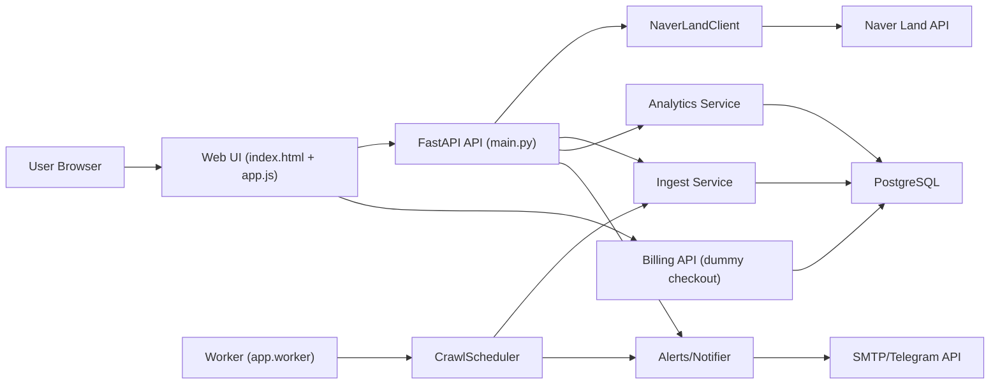

# 기술 문서: SW 구성/데이터 흐름/크롤링 방식 (2026-02-11)

## 1) 문서 목적
이 문서는 아래 4가지를 코드 기준으로 명확하게 설명한다.

1. 소프트웨어 컴포넌트가 어떻게 구성되어 있는가
2. 데이터가 어떤 흐름으로 들어와 저장/분석/알림까지 가는가
3. 네이버 부동산 데이터를 어떤 방식으로 크롤링하는가
4. 현재 크롤링 방식의 특징/한계와 개선 우선순위는 무엇인가

---

## 2) 시스템 구성 (현재 코드 기준)

### 2-1) 구성요소
- Web UI (정적 파일)
  - 파일: `/Users/jeonggyu/workspace/naver_apt_briefing/backend/app/web/index.html`
  - 파일: `/Users/jeonggyu/workspace/naver_apt_briefing/backend/app/web/app.js`
  - 역할: 인증/관심단지/차트/알림 설정 화면

- API 서버 (FastAPI)
  - 파일: `/Users/jeonggyu/workspace/naver_apt_briefing/backend/app/main.py`
  - 역할: 인증, 크롤링 실행, 분석 조회, 사용자 설정 API 제공

- 스케줄러 워커
  - 파일: `/Users/jeonggyu/workspace/naver_apt_briefing/backend/app/services/scheduler.py`
  - 파일: `/Users/jeonggyu/workspace/naver_apt_briefing/backend/app/worker.py`
  - 역할: 지정 시각마다 관심 단지 수집 + 급매 알림 디스패치

- 네이버 크롤러 클라이언트
  - 파일: `/Users/jeonggyu/workspace/naver_apt_briefing/backend/app/crawler/naver_client.py`
  - 역할: 네이버 부동산 API 요청, 재시도, 응답 정규화

- 데이터 저장/분석 계층
  - 모델: `/Users/jeonggyu/workspace/naver_apt_briefing/backend/app/models.py`
  - 수집: `/Users/jeonggyu/workspace/naver_apt_briefing/backend/app/services/ingest.py`
  - 분석: `/Users/jeonggyu/workspace/naver_apt_briefing/backend/app/services/analytics.py`

- 알림 계층
  - 파일: `/Users/jeonggyu/workspace/naver_apt_briefing/backend/app/services/alerts.py`
  - 파일: `/Users/jeonggyu/workspace/naver_apt_briefing/backend/app/services/notifier.py`
  - 역할: 급매 후보 필터링, 이메일/텔레그램 발송, 중복 발송 방지

- 결제/권한 계층 (더미 결제 포함)
  - 파일: `/Users/jeonggyu/workspace/naver_apt_briefing/backend/app/services/billing.py`
  - 역할: FREE/PRO 플랜 관리, 기능 제한(쿼터) 검증, 더미 체크아웃 처리

- 인프라
  - 파일: `/Users/jeonggyu/workspace/naver_apt_briefing/backend/docker-compose.yml`
  - 구성: `app` + `worker` + `db(PostgreSQL)` 컨테이너

### 2-2) 런타임 다이어그램

---

## 3) 데이터 모델 핵심

### 3-1) 주요 테이블
- 사용자/인증
  - `users`
  - `auth_refresh_tokens`
  - `auth_access_token_revocations`

- 사용자 기능
  - `user_watch_complexes` (관심 단지)
  - `user_presets` (필터/차트 저장)
  - `user_notification_settings` (알림 채널/기준)
  - `user_subscriptions` (FREE/PRO 구독 상태)
  - `billing_checkout_sessions` (더미 결제 세션)

- 수집/분석
  - `crawl_runs` (1회 수집 실행 메타 + raw payload)
  - `listing_snapshots` (매물 정규화 데이터)

- 알림 이력
  - `alert_dispatch_logs` (중복 방지 dedupe key 저장)

### 3-2) 설계 포인트
- `crawl_runs.raw_payload`(JSONB)에 원본 응답 저장
  - 장점: 파싱 오류/스키마 변경 시 포렌식 가능
- `listing_snapshots.article_no`는 `BigInteger`
  - 실제 네이버 articleNo 범위를 안전하게 수용
- 알림 중복 방지 키:
  - `bargain:{complex_no}:{article_no}:{deal_price_manwon}`

---

## 4) 주요 데이터 흐름

### 4-1) 관심 단지 등록 흐름
1. 사용자 입력(단지명) -> `GET /crawler/search/complexes`
2. 검색 결과에서 `complex_no` 선택
3. `POST /me/watch-complexes` 호출
4. `user_watch_complexes`에 저장

### 4-2) 수동 수집(ingest) 흐름
1. `POST /crawler/ingest/{complex_no}?page=1&max_pages=1`
2. `NaverLandClient.fetch_complex_articles` 호출
3. `crawl_runs` 생성
4. `listing_snapshots` 다건 insert
5. 분석 API에서 집계 조회

### 4-3) 스케줄 수집 + 급매 알림 흐름
1. `worker` 컨테이너가 `app.worker` 엔트리포인트로 시작
2. 지정 시각(`SCHEDULER_TIMES_CSV`)마다 대상 단지(`SCHEDULER_COMPLEX_NOS_CSV`) 수집
3. 사용자별 관심 단지/알림 설정 조회
4. 급매 조건 충족 항목 산출
5. 이메일/텔레그램 발송 시도
6. 성공 건은 `alert_dispatch_logs`에 기록(중복 방지)

### 4-5) 더미 결제 + 권한 활성화 흐름
1. 사용자가 `POST /billing/checkout-sessions` 호출
2. 서버가 더미 체크아웃 세션(`PENDING`) 생성
3. 사용자가 `POST /billing/checkout-sessions/{checkout_token}/complete` 호출
4. 세션이 `COMPLETED`로 전환되고 `user_subscriptions.plan_code=PRO` 활성화
5. 기능 제한 게이트(`watch/preset/compare/manual alert`)가 즉시 PRO 권한으로 평가

### 4-4) 분석 흐름
- `GET /analytics/trend/{complex_no}`
  - 일자별 평균/최저/최고/건수 집계
- `GET /analytics/compare`
  - 다중 단지 일자별 평균가 비교
- `GET /analytics/bargains/{complex_no}`
  - 최근 N일 중위값 대비 할인율 임계치 이상 탐지

---

## 5) 네이버 부동산 크롤링 방식

### 5-1) 접근 방식
브라우저 렌더링(HTML 파싱) 대신, 네이버 부동산의 JSON API 엔드포인트를 호출한다.

- 단지 검색:
  - `GET /api/search?keyword=...`
- 단지 매물:
  - `GET /api/articles/complex/{complex_no}` + 쿼리 파라미터

베이스 URL:
- `NAVER_LAND_BASE_URL=https://new.land.naver.com`

### 5-2) 헤더 전략
`NaverLandClient._default_headers`에서 다음을 설정한다.
- `User-Agent`
- `Accept`
- `Accept-Language`
- `Referer`
- `Origin`
- 선택값: `Authorization`, `Cookie`

운영 현실:
- 429 회피와 안정적인 응답을 위해 `Authorization`/`Cookie` 제공이 사실상 중요하다.

### 5-3) 재시도/백오프
`_request_json` 동작:
- `CRAWLER_MAX_RETRY`만큼 재시도
- 재시도 대상:
  - HTTP 429
  - HTTP 5xx
  - API code: `TOO_MANY_REQUESTS`, `TEMPORARY_ERROR`, `INTERNAL_SERVER_ERROR`
  - 네트워크 오류/타임아웃
- 대기:
  - `Retry-After` 헤더 우선
  - 없으면 exponential backoff + jitter

### 5-4) 파싱/정규화
- article 단위로 필요한 필드를 매핑
- 가격 텍스트 -> `만원` 단위 정수로 변환(`price_to_manwon`)
- 날짜 문자열 -> `date` 변환(`parse_confirmed_date`)
- 원본 article는 `listing_meta`로 저장

### 5-5) 페이지 처리
- `ingest_complex_snapshot`에서 `page ~ page+max_pages-1` 순차 조회
- 같은 실행(run) 내에서는 `article_no` 중복 제거
- 빈 페이지가 나오면 조기 종료

---

## 6) 현재 크롤링 방식의 특징

### 6-1) 강점
- JSON API 기반이라 HTML 구조 변경 영향이 상대적으로 작다.
- 원본 payload 저장으로 디버깅/재처리 가능성이 높다.
- 재시도/백오프로 일시 장애 복원력이 있다.
- 인증/쿠키 헤더를 외부 설정으로 분리하여 운영 튜닝이 가능하다.

### 6-2) 약점/한계
1. 비공식 API 의존
- 네이버 내부 변경 시 응답 스키마/정책이 바뀔 수 있다.

2. 세션 의존성
- `Authorization`/`Cookie` 만료 시 429/오류 빈도가 급증할 수 있다.
- 주기적 갱신 운영이 필요하다.

3. 더미 결제의 본질적 한계
- 실제 PG(결제사) 승인/취소/환불 이벤트가 없으므로 금전 거래를 대체할 수 없다.
- 현재는 유료 기능 게이팅 검증 목적의 개발용 흐름이다.

4. 수집 파이프라인 단일 경로
- 큐/워커 분리가 없어 대량 단지 확장 시 처리량과 장애격리에 한계가 있다.

5. 데이터 품질 리스크
- 단지/매물 필드 스키마 변화 시 파서 유지보수가 필요하다.

6. 정책/컴플라이언스 리스크
- 데이터 수집/활용은 대상 서비스 정책과 관련 법 검토가 필요하다.

---

## 7) 개선 우선순위 (실무형)

### P1. 안정 운영
- 스케줄러 실행 상태 모니터링/알림
- 실패율, 429율, 수집 건수 지표화

### P2. 데이터 품질
- 스키마 드리프트 감지 테스트 추가
- 파싱 실패 레코드 샘플 저장/리포트
- 단지 메타(주소/유형) 정규화 강화

### P3. 확장성
- 큐 도입(예: Redis 기반 task queue)
- 단지별 요청 속도 제한(rate limit) 세분화
- 분석 조회 캐싱

### P4. 운영 자동화
- 네이버 세션값 갱신 작업 표준화(runbook)
- DB 백업 자동화 + 복구 리허설 주기화

---

## 8) 관측/운영 체크포인트
- Health check: `GET /health`
- 앱 로그: `docker compose logs -f app`
- 주요 운영 지표(권장)
  - 수집 성공/실패 건수
  - 429 비율
  - 페이지당 매물 수
  - 알림 발송 성공률(이메일/텔레그램)
  - 중복 발송 차단 수(alert dedupe)

---

## 9) 한 줄 요약
현재 방식은 "빠른 제품 검증"에 매우 유리한 구조다.
이미 워커 분리와 더미 결제 게이팅까지 반영됐고, 다음 핵심은 "실결제 연동 + 운영 관측 강화"다.

---

## 10) 유료 서비스 확장을 위한 아키텍처 가드레일
현재 코드에 큰 수정을 하지 않으면서도, 유료화 단계로 자연스럽게 넘어가기 위한 설계 원칙이다.

### 10-1) 서비스 경계(권장)
- API 서비스
  - 인증, 사용자 설정, 분석 조회, 대시보드 응답
- 워커 서비스
  - 주기 크롤링, 급매 탐지, 알림 발송
- DB 서비스
  - 원본 스냅샷 + 파생 지표 저장

핵심:
- "응답 처리(API)"와 "배치 처리(수집/알림)"를 분리해 장애 전파를 줄인다.

### 10-2) 도메인 경계(권장)
- 계정/권한 도메인
- 수집(ingest) 도메인
- 분석(analytics) 도메인
- 알림(notify) 도메인
- 결제/구독(billing) 도메인 (더미 버전 구현됨)

핵심:
- billing 도메인을 기존 인증 도메인에 강결합하지 말고, 플랜/쿼터 검증 계층으로 분리한다.

### 10-3) 플랜/쿼터 삽입 지점
유료화 시 아래 API 지점에서 쿼터 체크를 넣기 좋다.
- `POST /me/watch-complexes`: 관심 단지 수 제한
- `POST /me/alerts/bargains/dispatch`: 수동 알림 횟수 제한
- `GET /analytics/compare`: 비교 단지 수 제한
- `GET /me/presets`: 저장 프리셋 수 제한

### 10-4) 데이터 계층 확장 권장
- 원본층: `crawl_runs`, `listing_snapshots` 유지
- 파생층(신규): 일/주 단위 집계 테이블
- 상품층(신규): 프리미엄 지표/리포트 캐시 테이블

핵심:
- 원본 데이터와 상품화된 데이터(유료 기능)를 분리하면 회계/정책/성능 관리가 쉬워진다.

### 10-5) 운영/보안 체크
- 토큰/비밀값은 환경변수 + 시크릿 매니저로 이관
- 알림 채널 장애 시 재시도 큐 도입
- 감사 로그(관리자 액션/과금 이벤트) 분리 저장
- 결제 이벤트 웹훅 서명 검증 및 재처리 경로 확보
